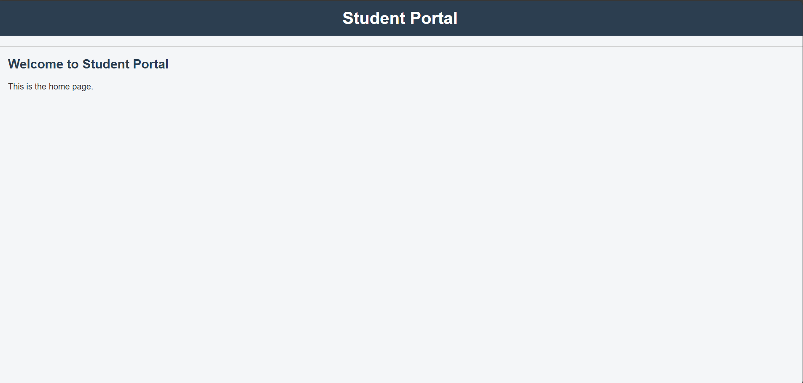
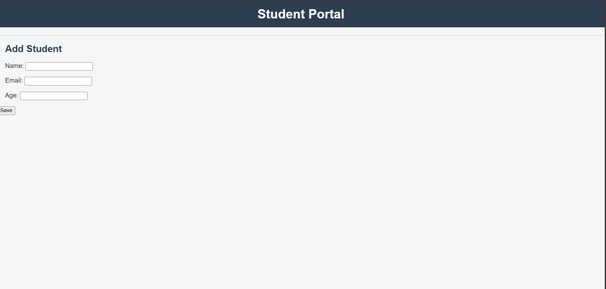
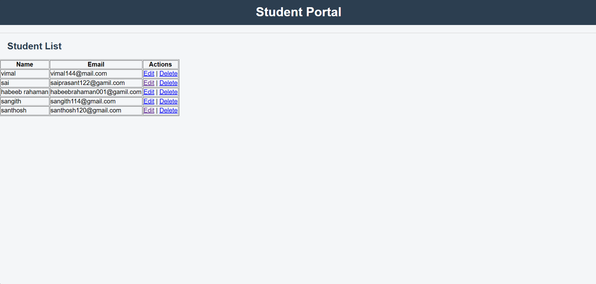

#  Student Management System (Django)

A simple and clean **Django CRUD application** to manage student records.  
This project demonstrates core Django concepts including models, forms, views, templates, and GitHub version control.

---

##  Features

- ➕ Add new students
- 📋 View student list
- ✏️ Update student details
- ❌ Delete students
- 🔔 Success messages for actions
- 🧹 Clean GitHub repository with `.gitignore`
- 🔍 Search students by name and email
- 📄 Pagination for student list using Django Paginator


---

##  Tech Stack

- **Backend:** Python 3.12, Django 6.0  
- **Database:** SQLite  
- **Frontend:** HTML, CSS  
- **Version Control:** Git & GitHub  

---


## ⚙️ Installation & Setup

Follow these steps to run the project locally:

```bash
git clone https://github.com/Sangith-dev/student-management-django.git
cd student-management-django
python -m venv env
env\Scripts\activate
pip install django
python manage.py migrate
python manage.py createsuperuser
python manage.py runserver


##  Screenshots

### Home Page


### Add Student


### Student List


### Update Student



## Author

Sangith M
- GitHub: https://github.com/Sangith-dev  
- LinkedIn: https://www.linkedin.com/in/sanjith-saji-453082315